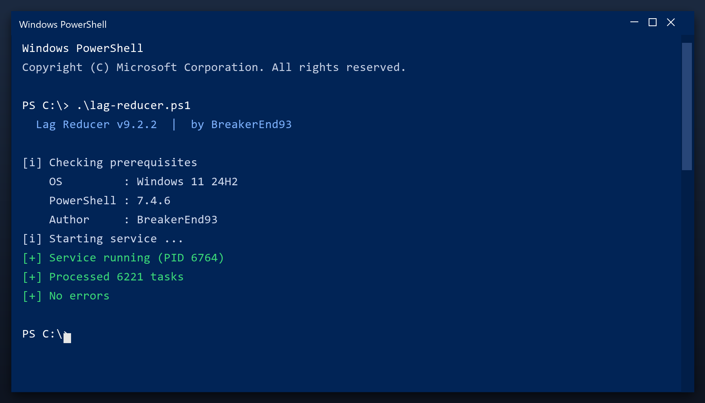

# Download Lag Reducer for Free — Latest 2026 Version

  

Lag reducer is a lightweight Windows program for maintaining your system. It runs offline, uses very little memory and does not slow your computer down. **Completely free.**

  

  

## What It Does

Think of lag reducer as a housekeeper for your computer. Over time, files pile up that nobody uses - installers you ran once, caches, old logs. The tool finds those piles and clears them, which frees space and often speeds the PC up.

| **Term** | **Meaning** |
| --- | --- |
| **Cache** | Saved data that can be rebuilt |
| **Leftover** | A file an uninstall forgot |
| **Duplicate** | The same file stored twice |
| **Free space** | Room available on your drive |

## Requirements

| **Component** | **Minimum** | **Recommended** |
| --- | --- | --- |
| **OS** | Windows 10 | Windows 11 (64-bit) |
| **RAM** | 2 GB | 4 GB |
| **Disk** | 100 MB free | 500 MB free |
| **Network** | For download | For updates |

## Install in a Nutshell

1. **Download** and unzip the package
2. **Right-click** the program and choose Run as administrator
3. **Choose a scan type** (quick or deep)
4. **Wait** for the report
5. **Select** the items to remove and confirm

> **Note:** run the tool as administrator so it can clean system folders. Without admin rights it will only touch your own user files.

## Features

| **Feature** | **Details** |
| --- | --- |
| **Size** | Small download, quick install |
| **Scan speed** | Typically under 3 minutes |
| **Background use** | None when closed |
| **Ads** | None |
| **Bundled extras** | None |
| **Offline** | Works without internet |

## FAQ

**Will it speed up my games?**

It can help by freeing RAM and stopping background tasks, but it is not a game booster.

**Does it delete my downloads?**

No. It only removes temporary and leftover data, never your own files.

**Can I schedule it?**

Yes, you can set it to run weekly automatically.

**What if I do not like it?**

Uninstall it normally from Windows Settings - it leaves nothing behind.

---

*glossy-crane-352 · Updated 2026-10-10 · Shared under the MIT License*
